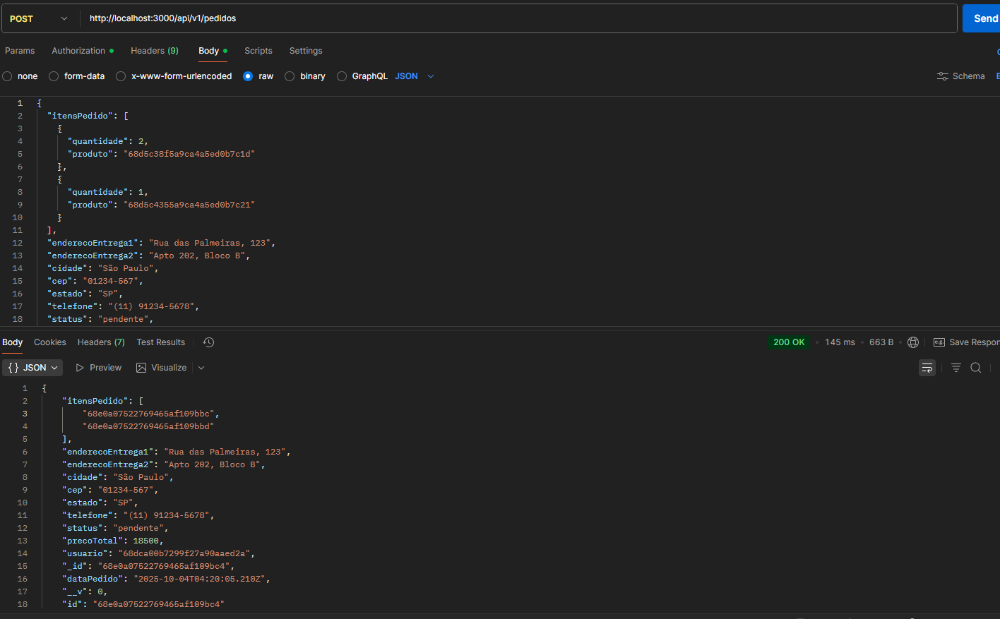
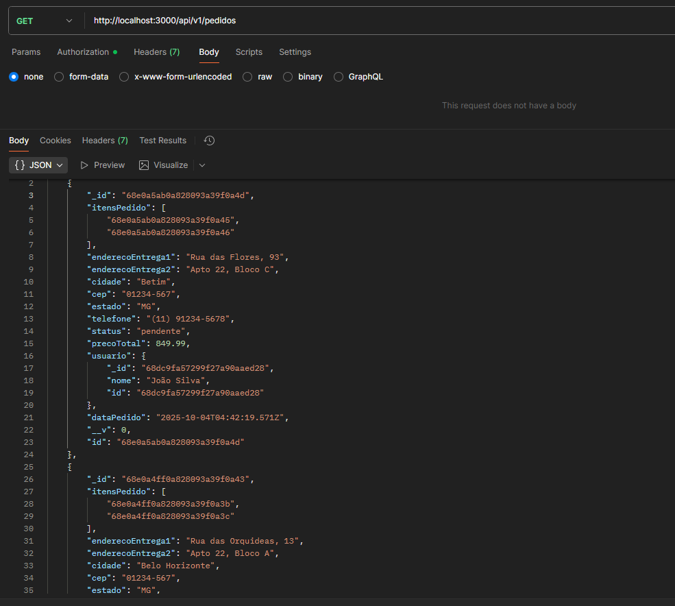
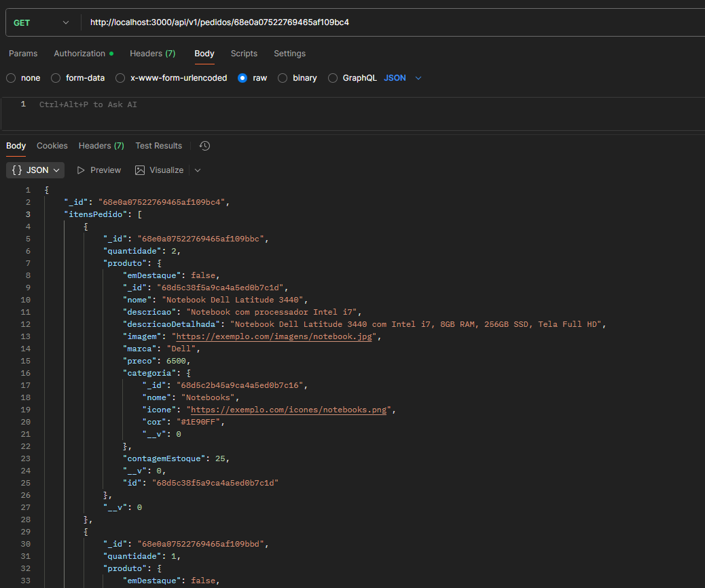
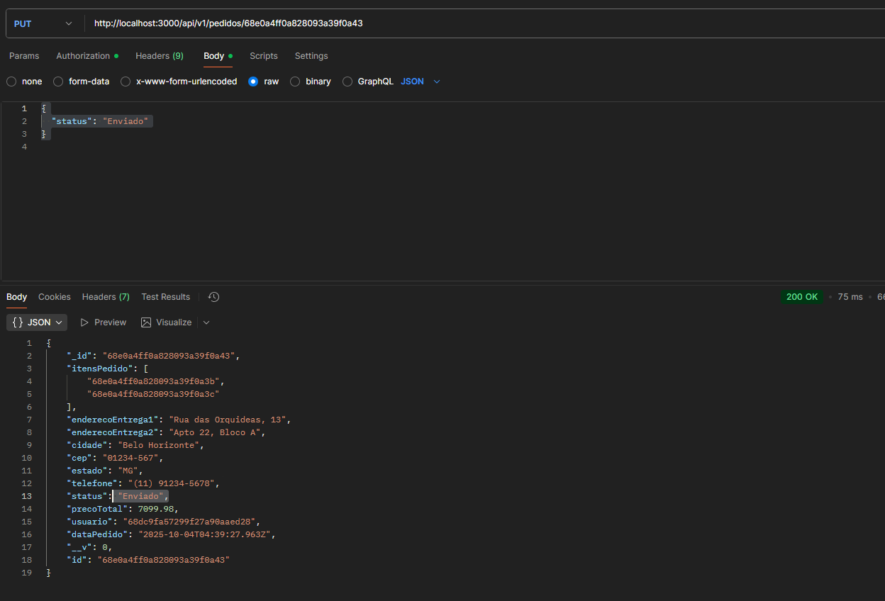
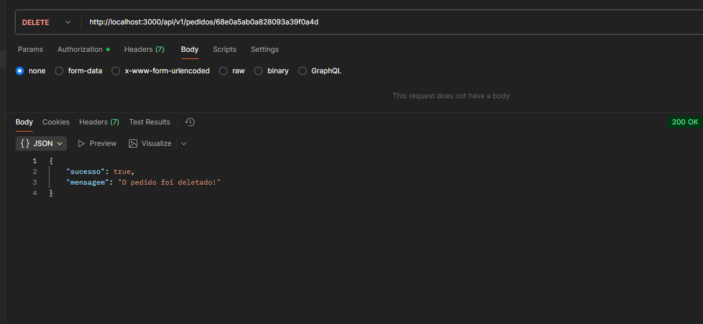

# APIs e Web Services

O projeto consiste no desenvolvimento de uma API escalável para um e-commerce B2B de itens eletrônicos (notebooks, mouses, fones, memórias RAM, etc.). Construída em Node.js com MongoDB, a API disponibiliza funcionalidades como cadastro de usuários, gerenciamento de produtos, categorias, pedidos e autenticação. Os endpoints são testados e validados utilizando o Postman.

## Objetivos da API

O primeiro passo é definir os objetivos da sua API. O que você espera alcançar com ela? Você quer que ela seja usada por clientes externos ou apenas por aplicações internas? Quais são os recursos que a API deve fornecer?

[Inclua os objetivos da sua api.]

## Modelagem da Aplicação

A aplicação utiliza MongoDB como banco de dados, com modelagem baseada em documentos. As principais entidades são: Usuário, Categoria, Produto, ItemPedido e Pedido. Cada entidade é representada por um Schema do Mongoose e possui relacionamentos entre si.

### Usuário

Representa os clientes e administradores da plataforma.

**Campos:**  
- `nome: String (obrigatório)`  
- `email: String (obrigatório)`  
- `Hashsenha: String (obrigatório, senha criptografada)`  
- `telefone: String (obrigatório)`  
- `isAdmin: Boolean (padrão: false)`  
- `rua: String`  
- `apartamento: String`  
- `cep: String`  
- `cidade: String`  
- `estado: String`  

###  Categoria

Organiza os produtos em grupos temáticos.

**Campos:**  
- `nome: String (obrigatório)`  
- `icone: String`  
- `cor: String`  

### Produto

Representa um item disponível para compra.

**Campos:**  
- `nome: String (obrigatório)`  
- `descricao: String (obrigatório)`  
- `descricaoDetalhada: String (padrão: "")`  
- `imagem: String (padrão: "")`  
- `marca: String (padrão: "")`  
- `preco: Number (padrão: 0)`  
- `categoria: ObjectId → Categoria (obrigatório)`  
- `contagemEstoque: Number (obrigatório, min: 0, max: 255)`  
- `emDestaque: Boolean (padrão: false)`  

### Pedido

Representa a compra realizada por um usuário.

**Campos:**  
- `itensPedido: [ObjectId → ItemPedido] (obrigatório)`  
- `enderecoEntrega1: String (obrigatório)`  
- `enderecoEntrega2: String`  
- `cidade: String (obrigatório)`  
- `cep: String (obrigatório)`  
- `estado: String (obrigatório)`  
- `telefone: String (obrigatório)`  
- `status: String (obrigatório, padrão: "Pendente")`  
- `precoTotal: Number`  
- `usuario: ObjectId → Usuario (obrigatório)`  
- `dataPedido: Date (padrão: Date.now)`  

### 🔗 Relacionamentos  

- Um **Produto** pertence a **uma Categoria**.  
- Um **Pedido** é feito por **um Usuário**.  
- Um **Pedido** contém **vários ItensPedido**.  
- Cada **ItemPedido** referencia **um Produto**.  

## Tecnologias Utilizadas

Existem muitas tecnologias diferentes que podem ser usadas para desenvolver APIs Web. A tecnologia certa para o seu projeto dependerá dos seus objetivos, dos seus clientes e dos recursos que a API deve fornecer.

[Lista das tecnologias principais que serão utilizadas no projeto.]

## API Endpoints

Endpoints da API (localhost:3000) no Postman, focando no CRUD de Pedidos. Os exemplos demonstram requisições e respostas para operações como busca (GET), criação (POST), atualização (PUT) e exclusão (DELETE), validando o funcionamento integrado do sistema.

### Criar um novo pedido
- Método: POST
- URL: http://localhost:3000/api/v1/pedidos
- Headers: Content-Type: application/json
- Body (JSON)
- Capturas de tela do Postman em execução local (porta 3000) 

### Listar todos os pedidos
- Método: GET
- URL: http://localhost:3000/api/v1/pedidos
- Headers: Content-Type: Nenhum obrigatório
- Body: Nenhum
- Capturas de tela do Postman em execução local (porta 3000) 

### Obter um pedido específico
- Método: GET
- URL: http://localhost:3000/api/v1/pedidos/:id   (Substitumos :id pelo _id do pedido no MongoDB)
- Headers: Content-Type: Nenhum obrigatório
- Body: Nenhum
- Resposta esperada: Detalhes do pedido
- Capturas de tela do Postman em execução local (porta 3000) 

### Atualizar alguma informação
- Método: PUT
- URL: http://localhost:3000/api/v1/pedidos/:id   (Substituimos :id pelo _id do pedido)
- Headers: Content-Type: application/json
- Body (JSON)
- Resposta esperada: Pedido atualizado com novo status por exemplo
- Capturas de tela do Postman em execução local (porta 3000) 

### Deletar pedido
- Método: DELETE
- URL: http://localhost:3000/api/v1/pedidos/:id   (Substituimos :id pelo _id do pedido)
- Headers: Content-Type:  Nenhum obrigatório
- Resposta esperada: Mensagem confirmando exclusão ou erro.
- Capturas de tela do Postman em execução local (porta 3000) 

## Considerações de Segurança

[Discuta as considerações de segurança relevantes para a aplicação distribuída, como autenticação, autorização, proteção contra ataques, etc.]

## Implantação

[Instruções para implantar a aplicação distribuída em um ambiente de produção.]

1. Defina os requisitos de hardware e software necessários para implantar a aplicação em um ambiente de produção.
2. Escolha uma plataforma de hospedagem adequada, como um provedor de nuvem ou um servidor dedicado.
3. Configure o ambiente de implantação, incluindo a instalação de dependências e configuração de variáveis de ambiente.
4. Faça o deploy da aplicação no ambiente escolhido, seguindo as instruções específicas da plataforma de hospedagem.
5. Realize testes para garantir que a aplicação esteja funcionando corretamente no ambiente de produção.

## Testes

1. **Validação de dados:** 
Objetivo: Garantir que os dados enviados aos endpoints estejam no formato e tipo corretos.

Resultados esperados:

Requisições com dados válidos (ex: id de produto correto, quantidade positiva) devem ser processadas com sucesso (ex: HTTP 200 ou 201). E Requisições com dados inválidos (ex: id inexistente, quantidade negativa, campos obrigatórios ausentes) devem retornar erros apropriados (ex: HTTP 500 ou 401) com mensagens claras

2. **Cadastro de um produto:** 
Resultados esperados:

Um novo produto com todos os campos obrigatórios preenchidos deve ser salvo no banco e retornar HTTP 200 OK

O banco deve refletir a inserção (verificável via MongoDB)

3. **Requisições com dados inválidos:** 
Requisições com dados faltantes ou inválidos devem ser rejeitadas

4. **Autenticação e autorização** 
Objetivo: Garantir segurança de acesso aos endpoints sensíveis.

# Referências

Inclua todas as referências (livros, artigos, sites, etc) utilizados no desenvolvimento do trabalho.

# Planejamento

##  Quadro de tarefas

> Apresente a divisão de tarefas entre os membros do grupo e o acompanhamento da execução, conforme o exemplo abaixo.

### Semana 1

Atualizado em: 21/04/2024

| Responsável   | Tarefa/Requisito | Iniciado em    | Prazo      | Status | Terminado em    |
| :----         |    :----         |      :----:    | :----:     | :----: | :----:          |
| Vitoria Soares        | Estrutura inicial das apis | 04/09/2025     | 05/10/2025 | 📝    |      |
| AlunaZ        | Objetivos    | 03/02/2024     | 10/02/2024 | 📝    |                 |
| AlunoY        | Histórias de usuário  | 01/01/2024     | 07/01/2005 | ⌛     |                 |
| AlunoK        | Personas 1  |    01/01/2024        | 12/02/2005 | ❌    |       |

#### Semana 2

Atualizado em: 21/04/2024

| Responsável   | Tarefa/Requisito | Iniciado em    | Prazo      | Status | Terminado em    |
| :----         |    :----         |      :----:    | :----:     | :----: | :----:          |
| AlunaX        | Página inicial   | 01/02/2024     | 07/03/2024 | ✔️    | 05/02/2024      |
| AlunaZ        | CSS unificado    | 03/02/2024     | 10/03/2024 | 📝    |                 |
| AlunoY        | Página de login  | 01/02/2024     | 07/03/2024 | ⌛     |                 |
| AlunoK        | Script de login  |  01/01/2024    | 12/03/2024 | ❌    |       |

Legenda:
- ✔️: terminado
- 📝: em execução
- ⌛: atrasado
- ❌: não iniciado

