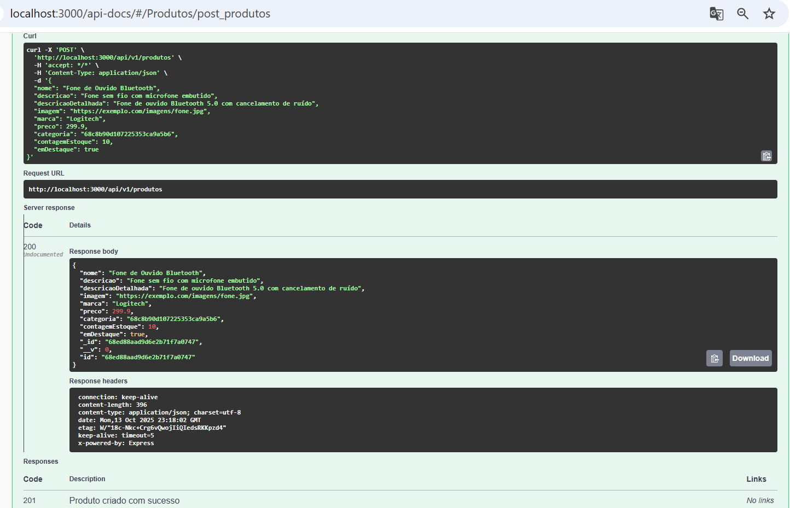
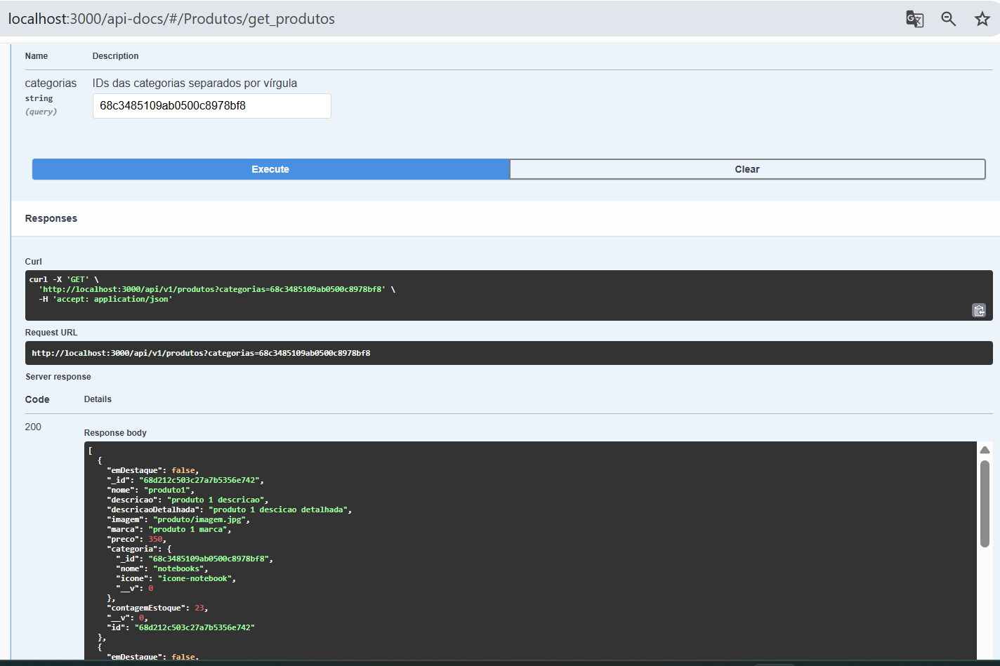
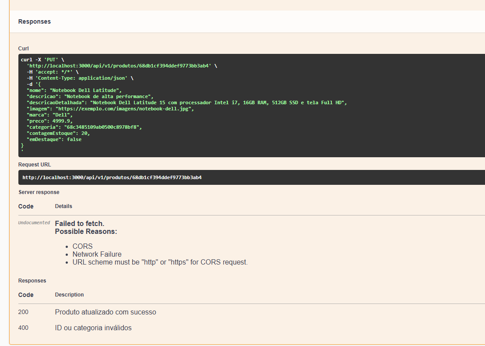
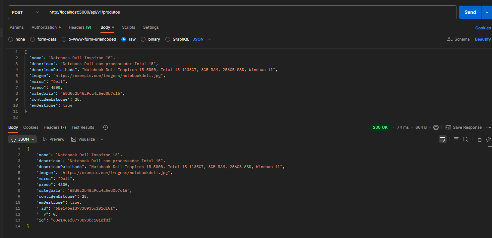
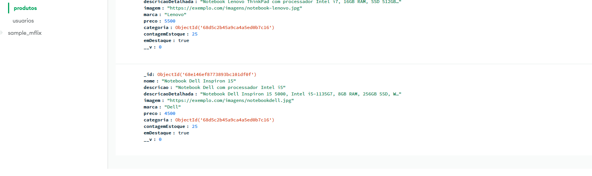
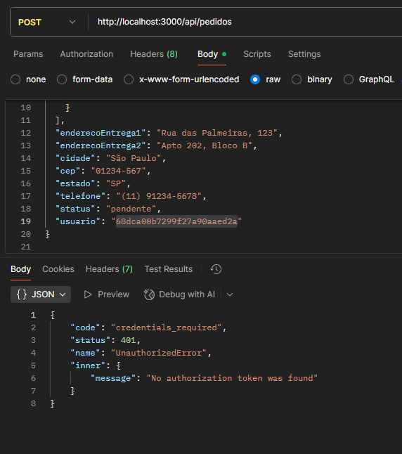

# APIs e Web Services

O projeto consiste no desenvolvimento de uma API escalável para um e-commerce B2B de itens eletrônicos (notebooks, mouses, fones, memórias RAM, etc.). Construída em Node.js com MongoDB, a API disponibiliza funcionalidades como cadastro de usuários, gerenciamento de produtos, categorias, pedidos e autenticação. Os endpoints são testados e validados utilizando o Postman.


## Objetivos da API

A API do nosso E-commerce foi desenvolvida para fornecer uma interface simples, segura e escalável para gerenciamento de produtos, categorias, pedidos e usuários. Sua finalidade é:
- Permitir a integração entre o back-end e o front-end da aplicação de e-commerce.  
- Oferecer endpoints REST para operações de CRUD (criar, ler, atualizar e deletar) sobre os principais recursos do sistema.  
- Garantir segurança na autenticação e autorização de usuários por meio de **JWT (JSON Web Token)**. 

### Recursos principais expostos pela API
As rotas de **produtos** permitem gerenciar os itens disponíveis para venda no e-commerce.  
Todas as operações de criação, atualização e exclusão exigem **autenticação via JWT** (usuário administrador).

As rotas de **categorias** permitem organizar os produtos em grupos lógicos.  
Todas as operações de criação, atualização e exclusão exigem **autenticação via JWT** (usuário administrador).

As rotas de **pedidos** permitem criar, listar, atualizar e excluir pedidos de clientes, além de obter métricas como vendas totais e contagem de pedidos.  
Todas as operações exigem **autenticação via JWT** (usuário autenticado), sendo que algumas operações específicas (como listar todos ou deletar pedidos) devem ser restritas a administradores.

As rotas de **usuários** permitem o gerenciamento de clientes e administradores do sistema, além de oferecer endpoints de autenticação (login e registro).  
As rotas de administração (listar, criar, atualizar e deletar usuários) exigem **autenticação via JWT** e privilégios de administrador.


## Modelagem da Aplicação

A aplicação utiliza MongoDB como banco de dados, com modelagem baseada em documentos. As principais entidades são: Usuário, Categoria, Produto, ItemPedido e Pedido. Cada entidade é representada por um Schema do Mongoose e possui relacionamentos entre si.

### Usuário

Representa os clientes e administradores da plataforma.

**Campos:**  
- `nome: String (obrigatório)`  
- `email: String (obrigatório)`  
- `Hashsenha: String (obrigatório, senha criptografada)`  
- `telefone: String (obrigatório)`  
- `isAdmin: Boolean (padrão: false)`  
- `rua: String`  
- `apartamento: String`  
- `cep: String`  
- `cidade: String`  
- `estado: String`  


###  Categoria

Organiza os produtos em grupos temáticos.

**Campos:**  
- `nome: String (obrigatório)`  
- `icone: String`  
- `cor: String`  


### Produto

Representa um item disponível para compra.

**Campos:**  
- `nome: String (obrigatório)`  
- `descricao: String (obrigatório)`  
- `descricaoDetalhada: String (padrão: "")`  
- `imagem: String (padrão: "")`  
- `marca: String (padrão: "")`  
- `preco: Number (padrão: 0)`  
- `categoria: ObjectId → Categoria (obrigatório)`  
- `contagemEstoque: Number (obrigatório, min: 0, max: 255)`  
- `emDestaque: Boolean (padrão: false)`  


### Pedido

Representa a compra realizada por um usuário.

**Campos:**  
- `itensPedido: [ObjectId → ItemPedido] (obrigatório)`  
- `enderecoEntrega1: String (obrigatório)`  
- `enderecoEntrega2: String`  
- `cidade: String (obrigatório)`  
- `cep: String (obrigatório)`  
- `estado: String (obrigatório)`  
- `telefone: String (obrigatório)`  
- `status: String (obrigatório, padrão: "Pendente")`  
- `precoTotal: Number`  
- `usuario: ObjectId → Usuario (obrigatório)`  
- `dataPedido: Date (padrão: Date.now)`  


### 🔗 Relacionamentos  

- Um **Produto** pertence a **uma Categoria**.  
- Um **Pedido** é feito por **um Usuário**.  
- Um **Pedido** contém **vários ItensPedido**.  
- Cada **ItemPedido** referencia **um Produto**.  


## Tecnologias Utilizadas

A API foi desenvolvida com base em tecnologias modernas que permitem escalabilidade, segurança e facilidade de manutenção.  
A tabela abaixo apresenta as principais ferramentas utilizadas no projeto:

| Categoria       | Tecnologia | Versão     | Por que foi escolhida? |
|-----------------|------------|------------|-------------------------|
| **Backend**     | Node.js    | 20.x       | Plataforma leve, rápida e amplamente utilizada para aplicações escaláveis em tempo real. |
| **Framework**   | Express.js | 4.x        | Framework minimalista para Node.js que simplifica a criação de APIs RESTful. |
| **Banco de Dados** | MongoDB | 6.x        | Banco de dados NoSQL orientado a documentos, flexível e ideal para aplicações que lidam com dados dinâmicos. |
| **Autenticação**| JWT (JSON Web Token) | - | Método seguro e simples para autenticação e autorização de usuários em APIs. |
| **Testes**      | Postman    | Última versão | Ferramenta prática para testar endpoints, validar requisições e documentar chamadas da API. |
| **Contêiner**      | Docker    | Última versão | Ferramenta utlizada para empacotar tudo que o código precisa para rodar (código, bibliotecas, configurações). |

## API Endpoints

Endpoints da API (localhost:3000) no Swagger, focando no CRUD de usuários. Os exemplos demonstram requisições e respostas para operações como busca (GET), criação (POST), atualização (PUT) e exclusão (DELETE), validando o funcionamento integrado do sistema.

### Capturas de tela do Swagger em execução local (porta 3000) - Testes do CRUD de produtos
- Método POST(Criação de um produto)





- Método: GET (Listar produtos com opção de filtrar por categorias)




- Método: PUT (Atualiza um produto existente)



- Método: DELETE


## Considerações de Segurança

A segurança é um aspecto crítico para qualquer API web, especialmente em aplicações de e-commerce que lidam com dados sensíveis. A seguir, estão as principais medidas adotadas nesta API:

- A API utiliza **JWT (JSON Web Token)** para autenticação.
- Usuários devem fornecer um token válido para acessar rotas protegidas.
- Tokens possuem **tempo de expiração de 24 horas**, reduzindo o risco de uso indevido em caso de vazamento.
- Senhas são **armazenadas criptografadas** usando **bcrypt**, garantindo que a senha real nunca seja salva no banco de dados.
- Boas práticas de configuração, como uso de variáveis de ambiente para chaves sensíveis..

## Implantação

 Passos necessários para implantar a aplicação em um ambiente de produção.

### Requisitos de Hardware e Software

### Hardware
- CPU: 2 cores ou mais
- Memória RAM: 4GB ou mais
- Armazenamento: 20GB ou mais
- Conectividade de rede estável

### Software
- Node.js (versão 20.x)
- MongoDB (versão 6.x ou compatível)
- Git
- NPM 
- Servidor web (opcional: Nginx ou Apache para proxy reverso)
- Docker/Docker Desktop
- Sistema operacional:  Windows ou Linux


### Configuração do Ambiente

1. **Clonar o repositório:**
   ```bash
   git clone https://github.com/ICEI-PUC-Minas-PMV-SI/pmv-si-2025-2-pe6-t2-turma2_g1.git 
   
   cd pmv-si-2025-2-pe6-t2-turma2_g1
   
   Conecte seu repositório Git;
    ```

2. **Instale o Docker/Docker Desktop:**
    
    Windows: https://docs.docker.com/desktop/setup/install/windows-install/
    
    Linux: https://docs.docker.com/engine/install/


3. **Inicie a API usando o Docker**

    Entre no diretório do projeto e execute o seguinte comando:
    
    ```bash
   docker compose up --build
   ```

   Caso queira parar o container, execute o comando:

   ```bash
   docker compose down
   ```

4. **O contêiner estará pronto para receber requisições na porta 3000**

5. **Testes em Produção:**

- Verifique se a API está acessível no endereço configurado 
- Teste endpoints principais com Postman ou ferramentas similares.
- Certifique-se de que a Autenticação JWT funciona corretamente.
- Operações CRUD estão funcionando em produtos, pedidos, categorias e usuários.


**[Escolha da Plataforma de Hospedagem]** A definir pelo grupo

## Testes

1. **Validação de dados:** 
Objetivo: Garantir que os dados enviados aos endpoints estejam no formato e tipo corretos.

Resultados esperados:

Requisições com dados válidos (ex: id de produto correto, quantidade positiva) devem ser processadas com sucesso (ex: HTTP 200 ou 201). E Requisições com dados inválidos (ex: id inexistente, quantidade negativa, campos obrigatórios ausentes) devem retornar erros apropriados (ex: HTTP 500 ou 401) com mensagens claras


2. **Cadastro de um produto:** 
Resultados esperados:

Um novo produto com todos os campos obrigatórios preenchidos deve ser salvo no banco e retornar HTTP 200 OK


O banco deve refletir a inserção (verificável via MongoDB)


3. **Requisições com dados inválidos:** 
Requisições com dados faltantes ou inválidos devem ser rejeitadas


4. **Autenticação e autorização** 
Objetivo: Garantir segurança de acesso aos endpoints sensíveis.


# Referências

Inclua todas as referências (livros, artigos, sites, etc) utilizados no desenvolvimento do trabalho.

- [Learn REST APIs](https://rapidapi.com/learn/rest#what-is-an-api)
- [Documentação oficial do Node.js](https://nodejs.org/en/docs)
- [Guia Express.js](https://expressjs.com/pt-br/)
- [Artigo sobre JWT Authentication](https://jwt.io/introduction/)
- [Microfundamento APIs e Web Services](https://pucminas.instructure.com/courses/155663)
- [Microfundamento: Desenvolvimento Web Back-End](https://pucminas.instructure.com/courses/149505)
- [E-Commerce API with Node JS](https://www.youtube.com/watch?v=hPv9QwvliEM&list=PLzb46hGUzitBp584kLyn6l3i6yC-rXlmN)
 

# Planejamento

##  Quadro de tarefas

> Apresente a divisão de tarefas entre os membros do grupo e o acompanhamento da execução, conforme o exemplo abaixo.

### Backend APIs

Atualizado em: 04/10/2025

| Responsável   | Tarefa/Requisito | Iniciado em    | Prazo      | Status | Terminado em    |
| :----         |    :----         |      :----:    | :----:     | :----: | :----:          |
| Vitoria         | Estrutura inicial das APIs | 04/09/2025     | 05/10/2025 | ✔️    | 16/09/2025     |
| Vitoria e Helberth        | API Produdo    | 04/09/2025     | 05/10/2025 | ✔️    |   29/09/2025              |
| Vitoria        | API Categoria  | 04/09/2025     | 05/10/2025 | ✔️     |  16/09/2025               |
| Nathan e Ian       | API Usuario e JWT  |    23/09/2025        | 05/10/2025 |  ✔️  |   04/10/2025     |
| Sophia e Rafael        | API Pedidos  |    23/09/2025        | 05/10/2025 | ✔️   |   04/10/2025    |
| Nathan       | Ambiente Docker  |    23/09/2025        | 05/10/2025 |  ✔️  |   29/09/2025     |

#### Documentação

Atualizado em: 04/10/2025

| Responsável   | Tarefa/Requisito | Iniciado em    | Prazo      | Status | Terminado em    |
| :----         |    :----         |      :----:    | :----:     | :----: | :----:          |
| Vitoria        | APIS e Web   | 27/09/2025     | 27/09/2025 | ✔️    | 27/09/2025      |
| Rafael        | Objetivos    | 04/10/2025     | 05/10/2025 | ✔️     |     04/10/2025            |
| Helberth        | Modelagem da aplicação    | 04/10/2025     | 05/10/2025 | ✔️     |     04/10/2025            |
| Sophia        | Tecnologias utilizadas    | 04/10/2025     | 05/10/2025 | ✔️     |     04/10/2025            |
| Vitoria        | APIs e endpoints    | 04/10/2025     | 05/10/2025 | ✔️     |     04/10/2025            |
| Sophia        | Considerações de segurança    | 04/10/2025     | 05/10/2025 | ✔️     |     04/10/2025            |
| Nathan        | Implantação    | 04/10/2025     | 05/10/2025 | ✔️     |     04/10/2025            |
| Ian        | Testes    | 04/10/2025     | 05/10/2025 | ✔️     |     04/10/2025            |

Legenda:
- ✔️: terminado
- 📝: em execução
- ⌛: atrasado
- ❌: não iniciado

