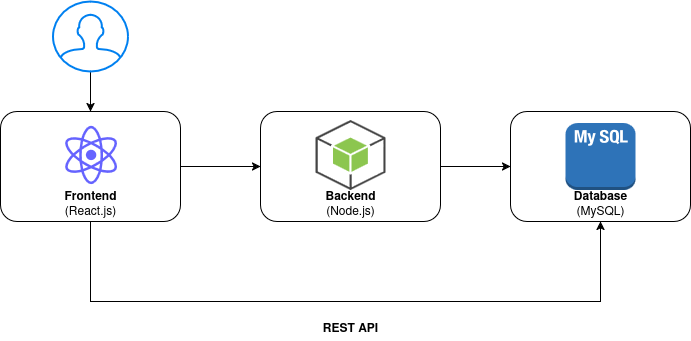

# Introdução
O contexto de criação deste projeto parte da necessidade crescente de empresas adquirirem insumos de tecnologia de forma rápida, confiável e automatizada, diante da evolução do mercado digital e da competitividade no setor de eletrônicos.
Dessa forma, este trabalho tem como objetivo desenvolver um sistema robusto e escalável, que permita atender múltiplas demandas de clientes corporativos, oferecendo facilidade na gestão de pedidos, controle de estoque e escalabilidade em servidores distribuídos.

## Problema
Atualmente, muitas empresas encontram dificuldades na aquisição de equipamentos eletrônicos em larga escala devido à escassez de plataformas de e-commerce voltadas especificamente para esse segmento. A maioria dos sistemas existentes é direcionada ao consumidor final ou que não contempla as necessidades particulares das empresas no processo de compra corporativa. Esse cenário gera alguns problemas como a ausência de padronização nos produtos, dificuldades na negociação em volume e processos pouco adaptados às demandas de empresas que necessitam de agilidade, previsibilidade e controle de estoque.
Portanto, o principal problema identificado é a inexistência de uma solução de e-commerce dedicada ao segmento B2B de eletrônicos, que seja capaz de oferecer escalabilidade e personalização para atender o mercado corporativo.

## Objetivos

### Objetivo Geral:
Desenvolver uma plataforma de e-commerce escalável, voltada para o modelo B2B, para a comercialização de itens eletrônicos de uma única marca, com suporte a múltiplos servidores e gerenciamento de estoque distribuído.

### Objetivos Específicos:
    1. Implementar um sistema de controle de estoque em tempo real, sincronizado em servidores distribuídos.
    2. Oferecer relatórios gerenciais detalhados sobre pedidos, clientes e movimentação de estoque.
    3. Garantir escalabilidade e alta disponibilidade por meio de arquitetura distribuída.
    4. Desenvolver uma interface amigável e responsiva, acessível em múltiplos dispositivos.
 
> **Links Úteis**:
> - [Objetivo geral e objetivo específico: como fazer e quais verbos utilizar](https://blog.mettzer.com/diferenca-entre-objetivo-geral-e-objetivo-especifico/)

## Justificativa

O mercado de tecnologia cresce em ritmo acelerado, aumentando a necessidade de soluções digitais que suportem alto desempenho, confiabilidade e escalabilidade. O comércio eletrônico, especialmente no modelo B2B, demanda plataformas robustas que consigam atender empresas compradoras com grandes volumes de pedidos sem comprometer a qualidade do serviço.
A escolha desse tema justifica-se pela relevância do setor de eletrônicos e pela carência de soluções escaláveis que integrem de maneira eficaz a gestão de estoque e pedidos distribuídos. Além disso, a escalabilidade da aplicação permitirá que a plataforma acompanhe o crescimento do negócio, evitando gargalos tecnológicos comuns em soluções pouco preparadas.
O projeto também será uma oportunidade de aprofundar o estudo em arquitetura distribuída, banco de dados escaláveis e tecnologias de e-commerce, que são áreas de alta demanda no mercado atual de TI.

## Público-Alvo

O público-alvo da plataforma são empresas de médio e grande porte, localizadas no Brasil, que dependem de tecnologia para suas operações principais e necessitam adquirir equipamentos eletrônicos de forma padronizada e em volume.

O perfil dessas empresas é caracterizado pela busca de eficiência operacional, controle de custos e padronização tecnológica. Elas enfrentam o desafio de encontrar fornecedores B2B especializados, que ofereçam um processo de compra ágil, negociação em volume e previsibilidade de estoque, fugindo da complexidade e da falta de foco das plataformas de varejo tradicionais.
### Persona 1 – Carlos

**Profissão** - Gerente de Compras

**Detalhes Pessoais:**
- Localização: São Paulo/SP
- Nível educacional: Superior Completo em Admnistração com MBA em Gestão de Suprimentos.

**Carreira:**
- Responsabilidades profissionais: Analisa requisições de compra, negocia com fornecedores, faz cotações, emite pedidos, acompanha entregas e gerencia o orçamento do setor. Passa boa parte do tempo em planilhas e sistemas de gestão.
- Objetivos: Otimizar o processo de aquisição, reduzir os custos de suprimentos no próximo ano e encontrar fornecedores confiáveis que padronizem os equipamentos da empresa.
- Desafios: Perder tempo com processos manuais e burocráticos; lidar com fornecedores que não cumprem prazos; falta de padronização de equipamentos que gera problemas para a equipe de TI e aumenta os custos de manutenção.
---

### Persona 2 – Ana

**Profissão** - Coordenadora de Infraestrutura de TI

**Detalhes Pessoais:**
- Localização: Florianópolis/SC
- Nível educacional: Superior Completo com Pós Graduação em Administração de Emperesas

**Carreira:**
- Responsabilidades profissionais: Gerencia servidores, garante a segurança da rede, planeja a expansão da capacidade tecnológica da empresa, dá suporte técnico à equipe e define as especificações dos equipamentos a serem comprados.
- Objetivos: Garantir 99.9% de uptime dos sistemas, implementar novas tecnologias que melhorem a performance da equipe e manter a infraestrutura de TI escalável para acompanhar o crescimento da empresa sem gargalos.
- Desafios: Equipamentos de baixa qualidade que causam falhas e retrabalho; falta de informações técnicas detalhadas nos sites dos fornecedores; dificuldade em comprar equipamentos padronizados em lote, o que complica a manutenção e o gerenciamento.
---
### Persona 3 – Marcos

**Profissão** - Coordenador de Logística e Operações

**Detalhes Pessoais:**
- Localização: Curitiba/PR
- Nível educacional: Superior Completo em Logística.

**Carreira:**
- Responsabilidades profissionais: Recebe e confere a mercadoria, guarda no estoque e entrega os produtos para as equipes da empresa que pedem.
- Objetivos: Manter o estoque 100% correto e entregar os materiais o mais rápido possível para quem precisa.
- Desafios: Lidar com entregas que chegam erradas ou atrasadas e a burocracia para resolver esses problemas.

# Especificações do Projeto

## Requisitos

As tabelas que se seguem apresentam os requisitos funcionais e não funcionais que detalham o escopo do projeto. Para determinar a prioridade de requisitos, aplicar uma técnica de priorização de requisitos e detalhar como a técnica foi aplicada.

### Requisitos Funcionais

|ID    | Descrição do Requisito  | Prioridade |
|------|-----------------------------------------|----|
|RF-001| Gestão de usuários: cadastro e gerenciamento de clientes e logistas. | ALTA | 
|RF-002| Gestão de produtos: cadastro, edição, exclusão e visualização de produtos.   | ALTA |
|RF-003| Carrinho de compras e checkout: adicionar, remover, ajustar a quantidade de produtos, exibir valor total da compra.   | ALTA |
|RF-004| Histórico de Pedidos: exibição do histórico de compras para clientes.  | MÉDIA |
|RF-005| Oferecer histórico de compras para cada cliente   | MÉDIA |
|RF-006| Gestão de estoque: atualização automática do estoque após efetivação da venda   | MÉDIA |

### Requisitos não Funcionais

|ID     | Descrição do Requisito  |Prioridade |
|-------|-------------------------|----|
|RNF-001| O sistema deve ser responsivo para rodar em um dispositivos móveis | ALTA | 
|RNF-002| Deve processar requisições do usuário em no máximo 3s |  BAIXA | 
|RNF-003| O banco de dados deve garantir integridade e consistência dos dados |  ALTA |

## Restrições

O projeto está restrito pelos itens apresentados na tabela a seguir.

|ID| Restrição                                             |
|--|-------------------------------------------------------|
|01| O projeto deverá ser entregue até o final do semestre |
|02| Não pode ser desenvolvido um módulo de backend |
|03| Só poderá ser criada uma conta de usuário por e-mail |
|04| O usuário não poderá ser cadastrado com CPF, e sim com CNPJ |
|05| As senhas deverão te no mínimo 8 caracteres, alternando entre letras, números e caracteres especiais e verificação de e-mail |
|06| Os preços serão tabelados |
|07| Os sistemas não irão coletar dados sensíveis |

Enumere as restrições à sua solução. Lembre-se de que as restrições geralmente limitam a solução candidata.

> **Links Úteis**:
> - [O que são Requisitos Funcionais e Requisitos Não Funcionais?](https://codificar.com.br/requisitos-funcionais-nao-funcionais/)
> - [O que são requisitos funcionais e requisitos não funcionais?](https://analisederequisitos.com.br/requisitos-funcionais-e-requisitos-nao-funcionais-o-que-sao/)

# Catálogo de Serviços

Descreva aqui todos os serviços que serão disponibilizados pelo seu projeto, detalhando suas características e funcionalidades.

# Arquitetura da Solução

Definição de como o software é estruturado em termos dos componentes que fazem parte da solução e do ambiente de hospedagem da aplicação.

## Tecnologias Utilizadas

Descreva aqui qual(is) tecnologias você vai usar para resolver o seu problema, ou seja, implementar a sua solução. Liste todas as tecnologias envolvidas, linguagens a serem utilizadas, serviços web, frameworks, bibliotecas, IDEs de desenvolvimento, e ferramentas.

Apresente também uma figura explicando como as tecnologias estão relacionadas ou como uma interação do usuário com o sistema vai ser conduzida, por onde ela passa até retornar uma resposta ao usuário.

## Hospedagem

Explique como a hospedagem e o lançamento da plataforma foi feita.

# Planejamento

##  Quadro de tarefas

> Apresente a divisão de tarefas entre os membros do grupo e o acompanhamento da execução, conforme o exemplo abaixo.

### Semana 1 (18/08/2025 à 25/08/2025)

Atualizado em: 25/08/2025

| Responsável   | Tarefa/Requisito | Iniciado em    | Prazo      | Status | Terminado em    |
| :----         |    :----         |      :----:    | :----:     | :----: | :----:          |
| Sophia        | Introdução | 18/08/2025     | 25/08/2025 | ✔️    | 21/08/2025      |
| Vitória        | Problema    | 18/08/2025     | 25/08/2025 | ✔️   |   21/08/2025      |
| Rafael        | Objetivos  | 18/08/2025     | 25/08/2025 | ✔️     |  21/08/2025       |
| Helberth        | Justificativa  |    18/08/2025  | 25/08/2025 | ✔️    |  21/08/2025   |
| Nathan       | Público Alvo  |    18/08/2025  | 25/08/2025 | ✔️    |  21/08/2025   |
| Ian     | Requisitos Funcionais  |    18/08/2025  | 25/08/2025 | ✔️    |  21/08/2025   |
| Helberth     | Requisitos não Funcionais  |    18/08/2025  | 25/08/2025 | ✔️    |  21/08/2025   |
| Ian     | Arquitetura de Solução  |    18/08/2025  | 25/08/2025 | ✔️    |  21/08/2025   |

Para utilização posteiormente
| Aluno W    | Problema    | 18/08/2025     | 25/08/2025 | 📝    |                 |
| AlunoY      | Histórias de usuário  | 01/01/2024   | 07/01/2005 | ⌛     |                 |
| AlunoK        | Personas 1  |    01/01/2024        | 12/02/2005 | ❌    |       |

#### Semana 2

Atualizado em: 21/04/2024

| Responsável   | Tarefa/Requisito | Iniciado em    | Prazo      | Status | Terminado em    |
| :----         |    :----         |      :----:    | :----:     | :----: | :----:          |
| AlunaX        | Página inicial   | 01/02/2024     | 07/03/2024 | ✔️    | 05/02/2024      |
| AlunaZ        | CSS unificado    | 03/02/2024     | 10/03/2024 | 📝    |                 |
| AlunoY        | Página de login  | 01/02/2024     | 07/03/2024 | ⌛     |                 |
| AlunoK        | Script de login  |  01/01/2024    | 12/03/2024 | ❌    |       |

Legenda:
- ✔️: terminado
- 📝: em execução
- ⌛: atrasado
- ❌: não iniciado
