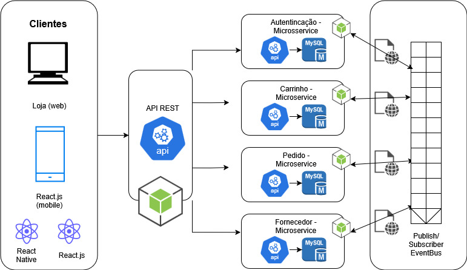

# Introdução
O contexto deste projeto insere-se em um cenário de transformação digital acelerada, no qual empresas de diferentes portes e segmentos dependem cada vez mais de soluções tecnológicas para manter sua operação eficiente e competitiva. Nesse ambiente, a aquisição de equipamentos e periféricos para notebooks — como mouses, teclados, headsets e adaptadores — torna-se uma necessidade recorrente, exigindo processos de compra ágeis, confiáveis e integrados aos fluxos internos de cada organização. A fragmentação de fornecedores, a variação de padrões de compatibilidade e a necessidade de controle rigoroso de estoque e garantias criam um espaço propício para plataformas especializadas que atendam exclusivamente ao mercado corporativo.

Atualmente, observa-se que o mercado de e-commerce é dominado por plataformas voltadas ao consumidor final, como Amazon, Mercado Livre e Shopee, que embora eficientes, não oferecem recursos específicos para empresas que compram em volume ou que necessitam de relatórios e integrações com sistemas internos de gestão. Uma empresa de tecnologia, por exemplo, que precise adquirir 200 headsets padronizados para sua equipe de suporte, encontra dificuldades em garantir disponibilidade, negociar condições comerciais adequadas e receber suporte técnico pós-venda em marketplaces tradicionais. Esse cenário evidencia a lacuna existente para soluções voltadas ao modelo B2B.

Um cenário possível para esse contexto seria de uma empresa de consultoria que contrata simultaneamente dezenas de novos colaboradores pode precisar adquirir kits padronizados de periféricos, com faturamento centralizado em um único CNPJ, mas entregas fracionadas para filiais em diferentes estados, mantendo rastreabilidade por colaborador e controle de garantias. Esse tipo de demanda exige não apenas um catálogo especializado, mas também uma infraestrutura capaz de lidar com pedidos complexos e de grande volume sem comprometer prazos ou qualidade.

Além disso, há situações de reposição emergencial que reforçam a importância de um canal B2B eficiente. Um exemplo seria de uma equipe de campo com centenas de notebooks distribuídos nacionalmente que, após uma auditoria de TI, precise repor dezenas de fontes e mouses de forma urgente, garantindo compatibilidade por modelo e SKU (código do produto), com consolidação financeira em um único pedido e múltiplas entregas simultâneas. Casos como esse evidenciam a necessidade de uma solução robusta, escalável e orientada para o mercado corporativo. 

Diante da realidade apresentada, propõe-se o desenvolvimento de uma plataforma de e-commerce escalável voltada exclusivamente para empresas, que centralize a compra de periféricos em um ambiente confiável e otimizado para transações corporativas.  

## Problema
Atualmente, muitas empresas encontram dificuldades na aquisição de equipamentos eletrônicos em larga escala devido à escassez de plataformas de e-commerce voltadas especificamente para esse segmento. A maioria dos sistemas existentes é direcionada ao consumidor final ou que não contempla as necessidades particulares das empresas no processo de compra corporativa. Esse cenário gera alguns problemas como a ausência de padronização nos produtos, dificuldades na negociação em volume e processos pouco adaptados às demandas de empresas que necessitam de agilidade, previsibilidade e controle de estoque.
Portanto, o principal problema identificado é a inexistência de uma solução de e-commerce dedicada ao segmento B2B de eletrônicos, que seja capaz de oferecer escalabilidade e personalização para atender o mercado corporativo.

## Objetivos

### Objetivo Geral:
Desenvolver uma plataforma de e-commerce escalável, voltada para o modelo B2B, para a comercialização de itens eletrônicos de uma única marca, com suporte a múltiplos servidores e gerenciamento de estoque distribuído.

### Objetivos Específicos:
    1. Implementar um sistema de controle de estoque em tempo real, sincronizado em servidores distribuídos.
    2. Oferecer relatórios gerenciais detalhados sobre pedidos, clientes e movimentação de estoque.
    3. Garantir escalabilidade e alta disponibilidade por meio de arquitetura distribuída.
    4. Desenvolver uma interface amigável e responsiva, acessível em múltiplos dispositivos.

## Justificativa

O mercado de tecnologia cresce em ritmo acelerado, aumentando a necessidade de soluções digitais que suportem alto desempenho, confiabilidade e escalabilidade. O comércio eletrônico, especialmente no modelo B2B, demanda plataformas robustas que consigam atender empresas compradoras com grandes volumes de pedidos sem comprometer a qualidade do serviço.
A escolha desse tema justifica-se pela relevância do setor de eletrônicos e pela carência de soluções escaláveis que integrem de maneira eficaz a gestão de estoque e pedidos distribuídos. Além disso, a escalabilidade da aplicação permitirá que a plataforma acompanhe o crescimento do negócio, evitando gargalos tecnológicos comuns em soluções pouco preparadas.
O projeto também será uma oportunidade de aprofundar o estudo em arquitetura distribuída, banco de dados escaláveis e tecnologias de e-commerce, que são áreas de alta demanda no mercado atual de TI.

## Público-Alvo

O público-alvo da plataforma são empresas de médio e grande porte, localizadas no Brasil, que dependem de tecnologia para suas operações principais e necessitam adquirir equipamentos eletrônicos de forma padronizada e em volume.

O perfil dessas empresas é caracterizado pela busca de eficiência operacional, controle de custos e padronização tecnológica. Elas enfrentam o desafio de encontrar fornecedores B2B especializados, que ofereçam um processo de compra ágil, negociação em volume e previsibilidade de estoque, fugindo da complexidade e da falta de foco das plataformas de varejo tradicionais.
### Persona 1 – Carlos

**Profissão** - Gerente de Compras

**Detalhes Pessoais:**
- Localização: São Paulo/SP
- Nível educacional: Superior Completo em Admnistração com MBA em Gestão de Suprimentos.

**Carreira:**
- Responsabilidades profissionais: Analisa requisições de compra, negocia com fornecedores, faz cotações, emite pedidos, acompanha entregas e gerencia o orçamento do setor. Passa boa parte do tempo em planilhas e sistemas de gestão.
- Objetivos: Otimizar o processo de aquisição, reduzir os custos de suprimentos no próximo ano e encontrar fornecedores confiáveis que padronizem os equipamentos da empresa.
- Desafios: Perder tempo com processos manuais e burocráticos; lidar com fornecedores que não cumprem prazos; falta de padronização de equipamentos que gera problemas para a equipe de TI e aumenta os custos de manutenção.
---

### Persona 2 – Ana

**Profissão** - Coordenadora de Infraestrutura de TI

**Detalhes Pessoais:**
- Localização: Florianópolis/SC
- Nível educacional: Superior Completo com Pós Graduação em Administração de Emperesas

**Carreira:**
- Responsabilidades profissionais: Gerencia servidores, garante a segurança da rede, planeja a expansão da capacidade tecnológica da empresa, dá suporte técnico à equipe e define as especificações dos equipamentos a serem comprados.
- Objetivos: Garantir 99.9% de uptime dos sistemas, implementar novas tecnologias que melhorem a performance da equipe e manter a infraestrutura de TI escalável para acompanhar o crescimento da empresa sem gargalos.
- Desafios: Equipamentos de baixa qualidade que causam falhas e retrabalho; falta de informações técnicas detalhadas nos sites dos fornecedores; dificuldade em comprar equipamentos padronizados em lote, o que complica a manutenção e o gerenciamento.
---
### Persona 3 – Marcos

**Profissão** - Coordenador de Logística e Operações

**Detalhes Pessoais:**
- Localização: Curitiba/PR
- Nível educacional: Superior Completo em Logística.

**Carreira:**
- Responsabilidades profissionais: Recebe e confere a mercadoria, guarda no estoque e entrega os produtos para as equipes da empresa que pedem.
- Objetivos: Manter o estoque 100% correto e entregar os materiais o mais rápido possível para quem precisa.
- Desafios: Lidar com entregas que chegam erradas ou atrasadas e a burocracia para resolver esses problemas.

# Especificações do Projeto

## Requisitos

As tabelas que se seguem apresentam os requisitos funcionais e não funcionais que detalham o escopo do projeto. Para determinar a prioridade de requisitos, aplicar uma técnica de priorização de requisitos e detalhar como a técnica foi aplicada.

### Requisitos Funcionais

|ID    | Descrição do Requisito  | Prioridade |
|------|-----------------------------------------|----|
|RF-001| Gestão de usuários: cadastro e gerenciamento de clientes e logistas. | ALTA | 
|RF-002| Gestão de produtos: visualização de produtos.   | ALTA |
|RF-003| Carrinho de compras e checkout: adicionar, remover, exibir valor total e finalizar compra.   | ALTA |
|RF-004| Histórico de Pedidos: exibição do histórico de compras para clientes.  | MÉDIA |

### Requisitos não Funcionais

|ID     | Descrição do Requisito  |Prioridade |
|-------|-------------------------|----|
|RNF-001| O sistema deve ser responsivo para rodar em um dispositivos móveis | ALTA | 
|RNF-002| Deve processar requisições do usuário em no máximo 3s |  BAIXA | 

## Restrições

O projeto está restrito pelos itens apresentados na tabela a seguir.

|ID| Restrição                                             |
|--|-------------------------------------------------------|
|01| O projeto deverá ser entregue até o final do semestre |

# Catálogo de Serviços

O e-commerce foi desenvolvido para proporcionar ao cliente uma experiência de compra prática, segura e completa

Cadastro e Gestão de Clientes Corporativos: Permite o registro de empresas compradoras com informações cadastrais, dados fiscais e contatos.
Possibilidade de atualização e gerenciamento de dados pelo próprio cliente.

Catálogo de Produtos: O usuário poderá explorar facilmente os produtos disponíveis, visualizar imagens, descrições detalhadas, preços e conferir a disponibilidade em estoque em tempo real.

Pagamentos Seguros e Ágeis: No momento da compra, será possível escolher entre diferentes formas de pagamento, como cartão de crédito, débito, Pix e outras opções, garantindo rapidez e transparência em cada transação.

Acompanhamento de Pedidos: O cliente terá acesso ao status do seu pedido desde a confirmação da compra até a entrega, com atualizações em tempo real para maior tranquilidade.
# Arquitetura da Solução

Definição de como o software é estruturado em termos dos componentes que fazem parte da solução e do ambiente de hospedagem da aplicação.

## Tecnologias Utilizadas

* Frontend: React.js (web) e React Native (mobile)
* Backend: Node.js com Express
* Banco de Dados: MySQL
* Ambiente de Desenvolvimento (IDE) : Visual Studio Code

### Fluxo de Interação do Usuário no E-commerce:
Um breve contexto de como o usuário interage com o sistema e como as tecnologias se conectam nesse processo

1. O usuário acessa o sistema pela interface web (React.js) ou pelo app mobile (React Native, que segue a mesma lógica).

2. Ele realiza ações como login, busca de produtos, adicionar ao carrinho, finalizar compra.

3. Quando o usuário interage, o frontend envia uma requisição pela REST API para o backend

4. O backend interpreta a requisição e consulta ou grava informações no MySQL como por exemplo buscar produtos, registrar de pedidos e carrinho, etc

5. O MySQL responde ao backend com os dados solicitados.

6. O Node.js organiza essa resposta em formato JSON e a envia de volta para o frontend via REST API.

7. O frontend recebe os dados (exemplo: lista de produtos ou confirmação de compra).

8. A interface é atualizada de forma interativa e dinâmica, garantindo boa experiência ao usuário.

## Hospedagem

A princípio, a aplicação foi projetada com uma arquitetura baseada em Docker Compose, garantindo portabilidade, escalabilidade inicial e simplicidade no gerenciamento dos serviços. Ela é composta por três principais componentes:
 
Backend: API REST construída com Node.js.
 
Banco de Dados: MySQL.
 
Frontend: Interface web desenvolvida com React.js
 
**Opções de Hospedagem:**

Frontend: Vercel

Backend: AWS EC2 ou ECS/Fargate
 
A hospedagem foi pensada para ser simples, utilizando serviços gratuitos ou de baixo custo, mas que permitam evolução futura para ambientes mais robustos.

# Planejamento

##  Quadro de tarefas

Apresentação da divisão de tarefas entre os integrantes da equipe e o acompanhamento/monitoramento da execução:

### Semana 1 (18/08/2025 à 25/08/2025)

Atualizado em: 25/08/2025

| Responsável   | Tarefa/Requisito | Iniciado em    | Prazo      | Status | Terminado em    |
| :----         |    :----         |      :----:    | :----:     | :----: | :----:          |
| Sophia        | Introdução | 18/08/2025     | 25/08/2025 | ✔️    | 21/08/2025      |
| Vitória        | Problema    | 18/08/2025     | 25/08/2025 | ✔️   |   21/08/2025      |
| Rafael        | Objetivos  | 18/08/2025     | 25/08/2025 | ✔️     |  21/08/2025       |
| Helberth        | Justificativa  |    18/08/2025  | 25/08/2025 | ✔️    |  21/08/2025   |
| Nathan       | Público Alvo  |    18/08/2025  | 25/08/2025 | ✔️    |  21/08/2025   |
| Ian     | Requisitos Funcionais  |    18/08/2025  | 25/08/2025 | ✔️    |  21/08/2025   |
| Helberth     | Requisitos não Funcionais  |    18/08/2025  | 25/08/2025 | ✔️    |  21/08/2025   |
| Ian     | Arquitetura de Solução  |    18/08/2025  | 25/08/2025 | ✔️    |  21/08/2025   |

### Semana 2 (25/08/2025 à 31/08/2025)

Atualizado em: 25/08/2025

| Responsável   | Tarefa/Requisito | Iniciado em    | Prazo      | Status | Terminado em    |
| :----         |    :----         |      :----:    | :----:     | :----: | :----:          |
| Helberth        | Correções da 1ª Semana  |    25/08/2025  | 31/08/2025 | ✔️    |  31/08/2025   |
| Helberth        | Adequação Requisitos Funcionais |    25/08/2025  | 31/08/2025 | ✔️    |  28/08/2025   |
| Sophia        | Catálogo de Serviços | 25/08/2025     | 31/08/2025 | ✔️    | 28/08/2025      |
| Vitória        | Tecnologias Utilizadas    | 25/08/2025     | 31/08/2025 | ✔️   |   28/08/2025      |
| Rafael        | Restrições | 25/08/2025     | 31/08/2025 | ✔️     |  28/08/2025       |
| Helberth        | Planejamento  |    25/08/2025  | 31/08/2025 | ✔️    |  31/08/2025   |
| Nathan       | Hospedagem  |    25/08/2025  | 31/08/2025 | ✔️    |  28/08/2025   |
| Ian     | Arquitetura de Solução |    25/08/2025  | 31/08/2025 | ✔️    |  28/08/2025   |

Legenda:
- ✔️: terminado
- 📝: em execução
- ⌛: atrasado
- ❌: não iniciado
