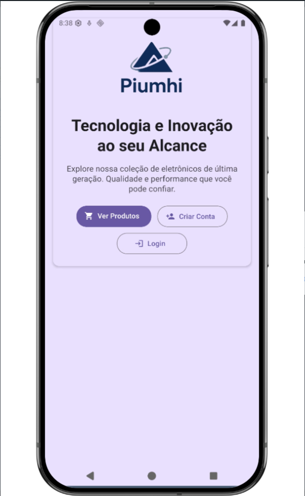
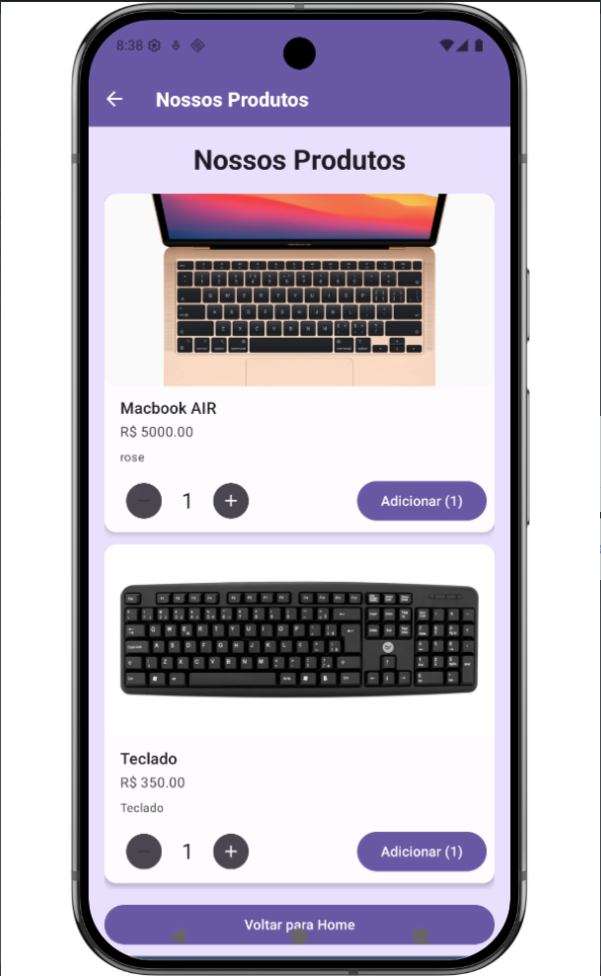
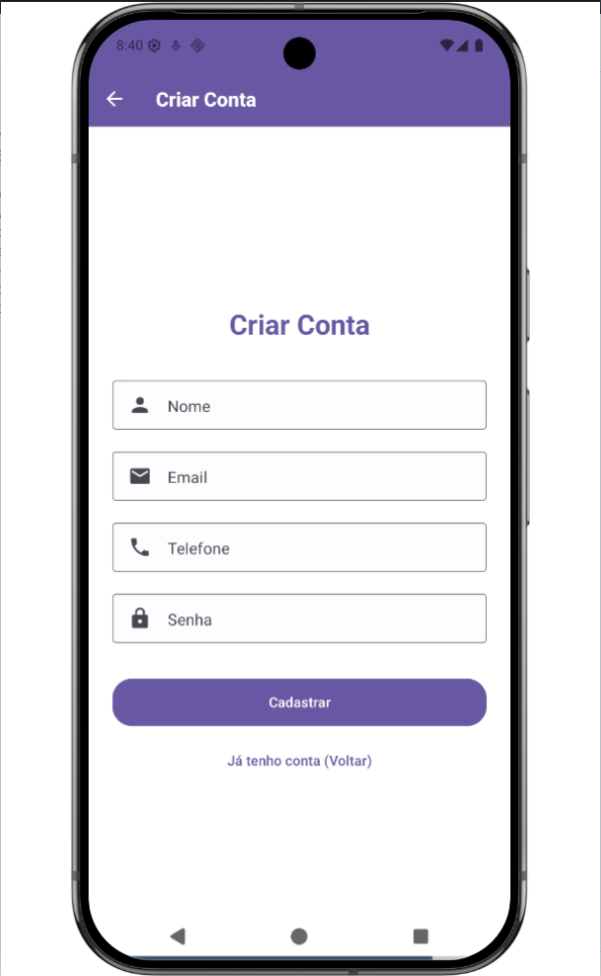

# Front-end Móvel

O projeto do front-end móvel consiste no desenvolvimento de um aplicativo para iOS e Android que serve como cliente para a plataforma de e-commerce B2B. O objetivo principal é oferecer uma experiência de compra nativa, ágil e intuitiva para os clientes corporativos, permitindo que realizem pedidos, consultem o catálogo de produtos e gerenciem suas contas diretamente de seus smartphones.

Desenvolvido com React Native e Expo, o aplicativo utiliza uma única base de código para ambas as plataformas, garantindo consistência visual e funcional. Ele se conecta à mesma API RESTful do back-end utilizada pela aplicação web, assegurando a sincronia de dados como estoque, pedidos e informações de usuários.

## Projeto da Interface
A interface móvel da aplicação foi desenvolvida com uma abordagem pragmática e funcional, utilizando o ecossistema React Native e a biblioteca de componentes React Native Paper. Isso estabelece uma base sólida no Material Design, garantindo uma experiência de usuário consistente, familiar e visualmente coesa em toda a aplicação.

Design Visual e Componentização O estilo visual é diretamente influenciado pelo Material Design, fornecido pelo react-native-paper.
Componentes Principais: A interface é construída com componentes padrão do Material Design, como:

Surface e Card: Usados extensivamente para agrupar informações, criando elevação e separação visual clara (visto em HomePage, HistoricoPedidos, CarrinhoCompras e ProdutosScreen). Button: Utilizado em seus diferentes modos (contained, outlined, text) para hierarquizar ações, desde chamadas primárias (Login, Finalizar Compra) até ações secundárias (Tentar Novamente, Ver Detalhes). TextInput: Implementado no estilo outlined com ícones, proporcionando um visual moderno e claro para formulários de Login e Registro. ActivityIndicator e Text: Combinados para criar estados de carregamento claros, informando ao usuário que os dados estão sendo buscados. Paleta de Cores (via useTheme): A aplicação utiliza o sistema de temas do react-native-paper. As cores são aplicadas de forma semântica, aproveitando o theme.colors:

primaryContainer: Usado como fundo para seções de destaque (heroSection) na Home e no Histórico, criando um ponto focal suave. primary: Cor de destaque para elementos importantes, como o indicador de carregamento. surface e surfaceVariant: Cores de fundo para os cards e superfícies, garantindo contraste e legibilidade. error: Aplicada consistentemente em textos de erro e botões de remoção (como no carrinho), fornecendo feedback visual imediato. Tipografia (via variant): A hierarquia de texto é gerenciada pela propriedade variant do componente Text, utilizando a escala tipográfica do Material Design:

headlineLarge / headlineMedium: Para títulos principais de páginas (HomePage, RegistrarScreen). titleMedium / titleLarge: Para títulos de cards e seções. bodyLarge / bodyMedium: Para textos descritivos e parágrafos. Iconografia: O uso de react-native-vector-icons/MaterialIcons reforça a identidade Material Design, com ícones claros e reconhecíveis aplicados em botões, inputs e indicadores de status.

Layout e Estrutura das Páginas O layout das telas é vertical e focado em tarefas, com uma estrutura clara e consistente.
Telas de Autenticação (Login.js, RegistrarScreen.js):

Layout: Formulário centralizado, utilizando ScrollView para se adaptar a diferentes tamanhos de tela. O layout é limpo, com um cabeçalho, campos de TextInput bem espaçados e botões de ação claros. Interação: O estado de isLoading desabilita os botões e exibe um loading durante a submissão, fornecendo feedback claro sobre a atividade de rede. Tela Principal (HomePage.js):

Layout: Funciona como um portal central. Uma grande Surface contém o logo e uma série de botões que direcionam para as principais funcionalidades. Interação: A lógica condicional (isLoggedIn) adapta a interface, exibindo botões de "Login/Criar Conta" para visitantes e "Carrinho/Histórico/Sair" para usuários autenticados. Tela de Produtos (ProdutosScreen.js):

Layout: O conteúdo principal é uma FlatList que renderiza Cards de produtos, uma abordagem eficiente para listas longas. Cada card é bem estruturado com Card.Cover, Card.Content e Card.Actions. Interação: Esta é a tela mais interativa. Cada card possui um seletor de quantidade (usando IconButton de minus e plus) e um botão "Adicionar" que reflete a quantidade selecionada. Um Alert customizado oferece ao usuário a opção de continuar comprando ou ir para o carrinho. Tela de Histórico (HistoricoPedidos.js):

Layout: Similar à tela de produtos, usa uma FlatList para exibir os pedidos passados em Surfaces individuais. A informação é organizada de forma clara: ID, data, status (com ícone) e total. Interação: Um botão "Ver Detalhes" em cada card aciona um Alert simples para mostrar mais informações, uma solução rápida sem a necessidade de navegar para outra tela. Tela do Carrinho (CarrinhoCompras.js):

Layout: Utiliza uma ScrollView com .map() para renderizar os itens, ideal para listas que não são excessivamente longas. A tela é dividida em três partes claras: a lista de itens, a seção de total e os botões de ação final. Interação: O usuário pode remover itens individualmente. O botão "Finalizar Compra" fica desabilitado se o carrinho estiver vazio ou durante o processamento, prevenindo ações indesejadas. 3. Fluxo de Usuário e Interações Navegação: O fluxo é gerenciado pelo @react-navigation/native. A navegação é explícita, baseada em botões que levam o usuário de uma tela para outra (ex: Home -> Produtos -> Carrinho). Feedback ao Usuário: Alertas: O Alert.alert é usado de forma eficaz para confirmar ações (item adicionado ao carrinho), notificar sucesso (pedido finalizado) ou exibir erros. Estados de Carregamento e Erro: Todas as telas que buscam dados da API (fetchProdutos, fetchPedidos) implementam uma lógica de três estados: isLoading (mostra ActivityIndicator), error (mostra mensagem e botão "Tentar Novamente") e sucesso (mostra a lista de dados). Isso torna a aplicação robusta e transparente para o usuário. Componente Reutilizável (Container): A presença de um componente Container sugere uma boa prática de encapsular o layout de base, garantindo que todas as telas compartilhem uma estrutura e preenchimento consistentes.

### Wireframes

### Design Visual

A identidade visual da aplicação é diretamente influenciada pelo **Material Design**, implementada através da biblioteca **React Native Paper**. Essa abordagem garante uma experiência de usuário consistente, familiar e visualmente coesa, aproveitando um sistema de design robusto e amplamente reconhecido.

1. Paleta de Cores
A aplicação utiliza o sistema de temas do `react-native-paper`, aplicando cores de forma semântica em vez de usar valores de cor fixos. Isso permite flexibilidade e consistência. As cores principais são acessadas via `theme.colors`:

*   **primary (`#6750A4`)**: Roxo, usado como cor de destaque para elementos interativos importantes, como o cabeçalho e o indicador de carregamento (`ActivityIndicator`).
*   **primaryContainer (`#EADDFF`)**: Lavanda claro, usado como cor de fundo para seções de destaque, como o cabeçalho da tela inicial, criando um ponto focal suave.
*   **secondary (`#625B71`)**: Cinza-azulado, para elementos secundários.
*   **surface (`#FFFBFE`)**: Branco com um leve tom de lavanda, cor principal para o fundo de `Card` e `Surface`.
*   **surfaceVariant (`#E7E0EC`)**: Cinza claro, para variantes de superfícies, garantindo contraste e separação visual.
*   **background (`#FFFBFE`)**: Cor de fundo geral da aplicação.
*   **error**: Aplicada consistentemente em mensagens de erro e em ações destrutivas (como o botão de remover item do carrinho), fornecendo feedback visual claro e imediato.
*   **onSurface**, **onPrimary**, etc.: Cores de texto e ícones, definidas pelo tema para garantir legibilidade sobre as cores de fundo correspondentes.

2. Tipografia
A hierarquia tipográfica é gerenciada pela propriedade `variant` do componente `Text` do `react-native-paper`, que utiliza a escala de tipos do Material Design. Isso garante que o texto seja legível e hierarquicamente organizado.

*   **headlineLarge / headlineMedium**: Para títulos principais de páginas (ex: `HomePage`, `RegistrarScreen`).
*   **titleLarge / titleMedium**: Para títulos de `Card` e seções internas.
*   **bodyLarge / bodyMedium**: Para textos descritivos, parágrafos e informações gerais.
*   **labelLarge**: Para o texto dentro de botões.

3. Ícones
Para reforçar a identidade visual do Material Design, a aplicação utiliza a biblioteca **react-native-vector-icons/MaterialIcons**. Os ícones são claros, reconhecíveis e aplicados de forma funcional em botões, campos de formulário e indicadores de status.

*   **Estilo**: Ícones preenchidos (filled), seguindo o padrão do Material Design.
*   **Uso**: `arrow-left` para navegação, `plus` e `minus` para seletores de quantidade, `cart` para o carrinho, `delete` para remoção de itens, etc.

4. Outros Elementos Gráficos
A componentização é feita com base nos elementos do `react-native-paper`:

*   **Botões (`Button`)**: Utilizados em seus diferentes modos (`contained`, `outlined`, `text`) para criar uma hierarquia clara de ações.
*   **Cards e Contêineres (`Card`, `Surface`)**: Usados extensivamente para agrupar informações, criando elevação e separação visual clara, como visto nas telas de produtos e histórico.
*   **Campos de Texto (`TextInput`)**: Implementados no estilo `outlined` com ícones, proporcionando um visual moderno e funcional para formulários.

Espaçamento:
O espaçamento e o layout seguem as diretrizes do Material Design, garantindo um ritmo visual consistente e uma interface organizada, principalmente através do uso de `padding` e `margin` nos componentes e no `Container` reutilizável.

## Fluxo de Dados

[Diagrama ou descrição do fluxo de dados na aplicação.]

## Tecnologias Utilizadas

* Frontend: React.js (web) e React Native (mobile)
* Backend: Node.js com Express
* Banco de Dados: Mongo DB
* Ambiente de Desenvolvimento (IDE) : Visual Studio Code
* Infraestrutura e Hospedagem: Kubernetes, Google Kubernetes Engine (GKE), Google Cloud Platform

## Considerações de Segurança

A segurança é um dos pilares fundamentais da nossa aplicação, tanto para proteger os dados dos usuários quanto para garantir a integridade das transações realizadas na plataforma. A seguir estão as principais práticas e mecanismos implementados:

### Autenticação e Autorização

- Utilização de **JWT (JSON Web Tokens)** para manter sessões de usuários com validade controlada e expiração.
- Tokens são armazenados com segurança no **AsyncStorage** no mobile, evitando exposições acidentais.

###  Proteção de Dados

- Dados sensíveis como senhas **nunca são armazenados diretamente**.
- Utiliza-se **hashing seguro (ex: bcrypt)** no backend quando necessário.
- Comunicação entre cliente e servidor é feita exclusivamente via **HTTPS**, garantindo confidencialidade no transporte.

###  Boas Práticas de API

- Rotas protegidas exigem **verificação do JWT**.
- Validação de dados de entrada para evitar **injeções de código**.

###  Segurança de Dependências

- Bibliotecas são mantidas **atualizadas**.
- Ferramentas como **npm audit** e **Dependabot** são utilizadas para identificar vulnerabilidades conhecidas.

---

## Implantação

1. Requisitos e Ferramentas

* Acesso: Conta Google Cloud (GKE e Artifact Registry) e conta Expo.dev.

* Local: Docker, gcloud CLI e kubectl instalados.

2. Configuração do Ambiente

* Backend: Configure as variáveis de ambiente (como MONGO_URL) utilizando Secrets e ConfigMaps no Kubernetes.

* Frontend: Aponte a API_URL no projeto React Native para o IP externo/Load Balancer do serviço no GKE.

3. Processo de Deploy

Backend (GKE):

Gere a imagem Docker do Node.js e envie para o Google Artifact Registry (docker push).

Atualize o cluster rodando os manifestos Kubernetes (kubectl apply -f k8s/).

Frontend (Expo):

Para atualizações de código: execute atualização no código.

4. Validação Verifique se os Pods estão com status Running (kubectl get pods) e teste o fluxo de login/dados no aplicativo via Expo Go conectando-se ao endpoint do GKE.

## Testes

A estratégia de testes escolhidas foi Teste de Integração para validar a comunicação entre os componentes do front-end mobile e a integração com a Web API.

Para realizarmos, percorremos a aplicação móvel como usuários reais, exercitamos as funcionalidades integradas oferecidas e registramos o comportamento observado, com o intuito de validar que os componentes do sistema funcionam juntos conforme esperado. Para tal, registramos momentos em que o software funcionou e, também, levantou exceções como esperado.

Os registros foram feitos à partir de prints do software rodando em tempo real.

Os testes foram documentados na apresentação de slides de PowerPoint, disponível para visualização e download à seguir.

[Teste de Integração Mobile - Piumhi](https://docs.google.com/presentation/d/1fWcwDrMT2vNHh9BR1tDdMFtAZVVFsBc4/edit?usp=sharing&ouid=109392622591362109472&rtpof=true&sd=true)

# Referências

- [Referencia tecnica projeto no expo.dev Prof Kleber](https://snack.expo.dev/@profklebersouza/mf-fuel-manager-sqlite)
- [Docs React](https://pt-br.react.dev/)
- [Docs React](https://reactnative.dev/docs/intro-react)
- [Microfundamento: Desenvolvimento de Aplicações Móveis](https://pucminas.instructure.com/courses/155666)
- [reactnavigation.org](https://reactnavigation.org/docs/getting-started/)

# Planejamento

##  Quadro de tarefas

> Apresente a divisão de tarefas entre os membros do grupo e o acompanhamento da execução, conforme o exemplo abaixo.

### Semana 1

Atualizado em: 21/04/2024

| Responsável   | Tarefa/Requisito | Iniciado em    | Prazo      | Status | Terminado em    |
| :----         |    :----         |      :----:    | :----:     | :----: | :----:          |
| AlunaX        | Introdução | 01/02/2024     | 07/02/2024 | ✔️    | 05/02/2024      |
| AlunaZ        | Objetivos    | 03/02/2024     | 10/02/2024 | 📝    |                 |
| AlunoY        | Histórias de usuário  | 01/01/2024     | 07/01/2005 | ⌛     |                 |
| AlunoK        | Personas 1  |    01/01/2024        | 12/02/2005 | ❌    |       |

#### Semana 2

Atualizado em: 21/04/2024

| Responsável   | Tarefa/Requisito | Iniciado em    | Prazo      | Status | Terminado em    |
| :----         |    :----         |      :----:    | :----:     | :----: | :----:          |
| AlunaX        | Página inicial   | 01/02/2024     | 07/03/2024 | ✔️    | 05/02/2024      |
| AlunaZ        | CSS unificado    | 03/02/2024     | 10/03/2024 | 📝    |                 |
| AlunoY        | Página de login  | 01/02/2024     | 07/03/2024 | ⌛     |                 |
| AlunoK        | Script de login  |  01/01/2024    | 12/03/2024 | ❌    |       |

Legenda:
- ✔️: terminado
- 📝: em execução
- ⌛: atrasado
- ❌: não iniciado

